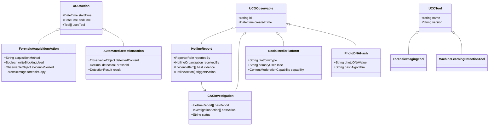

# ICAC Ontology Family Architecture

## Complete Import Chain

```mermaid
graph TD
    subgraph UCO/CASE
        UCO[UCO Core]
        CASE[CASE Investigation]
    end

    subgraph "ICAC Core"
        ICAC[icac-core.ttl]
        ICAC_SHAPES[icac-core-shapes.ttl]
        HOTLINES[hotlines-core.ttl]
        HOTLINES_SHAPES[hotlines-core-shapes.ttl]
        NCMEC[icac-us-ncmec.ttl]
    end

    subgraph "International & Global"
        INTERNATIONAL[icac-international.ttl]
        TRAINING[icac-training.ttl]
        PREVENTION[icac-prevention.ttl]
        LEGAL[icac-legal-harmonization.ttl]
    end

    subgraph "High-Priority Criminal Activities"
        PRODUCTION[icac-production.ttl]
        CUSTODIAL[icac-custodial.ttl]
        GROOMING[icac-grooming.ttl]
        SEXTORTION[icac-sextortion.ttl]
        ATHLETIC[icac-athletic-exploitation.ttl]
    end

    subgraph "Specialized Investigation"
        UNDERCOVER[icac-undercover.ttl]
        PHYSICAL[icac-physical-evidence.ttl]
        TACTICAL[icac-tactical.ttl]
        MULTI_JURISDICTION[icac-multi-jurisdiction.ttl]
        STRANGER[icac-stranger-abduction.ttl]
    end

    subgraph "Technical Support"
        FORENSICS[icac-forensics.ttl]
        FORENSICS_SHAPES[icac-forensics-shapes.ttl]
        DETECTION[icac-detection.ttl]
        PLATFORMS[icac-platforms.ttl]
        STREET[icac-street-recruitment.ttl]
    end

    subgraph "Victim Services & Legal"
        VICTIM_IMPACT[icac-victim-impact.ttl]
        TASKFORCE[icac-taskforce.ttl]
        SENTENCING[icac-sentencing.ttl]
        SPECIALIZED_UNITS[icac-specialized-units.ttl]
        SEX_OFFENDER[icac-sex-offender-registry.ttl]
    end

    subgraph Examples
        HOTLINE_EX[hotline-lifecycle.ttl]
        INVEST_EX[investigation-lifecycle.ttl]
        ENHANCED_EX[enhanced-investigation-lifecycle.ttl]
        DOUGLAS_EX[douglas-comprehensive-case.ttl]
        RHODE_ISLAND_EX[rhode-island-production-case.ttl]
        IDAHO_EX[idaho-operation-unhinged-example.ttl]
        ARKANSAS_EX[arkansas-operation-cyber-highway-safety-check-example.ttl]
        REGISTRY_EX[sex-offender-registry-integration-example.ttl]
        ILLINOIS_EX[illinois-attorney-general-case-example.ttl]
        INTERNATIONAL_EX[international-coordination-example.ttl]
        MORTON_EX[brooklyn-morton-october-2024-example.ttl]
        SEXTORTION_EX[wa-sextortion-case-example.ttl]
    end

    UCO --> ICAC
    CASE --> ICAC
    ICAC --> HOTLINES
    ICAC --> NCMEC
    
    ICAC --> INTERNATIONAL
    ICAC --> TRAINING
    ICAC --> PREVENTION
    ICAC --> LEGAL
    
    ICAC --> PRODUCTION
    ICAC --> CUSTODIAL
    ICAC --> GROOMING
    ICAC --> SEXTORTION
    ICAC --> ATHLETIC
    
    ICAC --> UNDERCOVER
    ICAC --> PHYSICAL
    ICAC --> TACTICAL
    ICAC --> MULTI_JURISDICTION
    ICAC --> STRANGER
    
    ICAC --> FORENSICS
    ICAC --> DETECTION
    ICAC --> PLATFORMS
    ICAC --> STREET
    
    ICAC --> VICTIM_IMPACT
    ICAC --> TASKFORCE
    ICAC --> SENTENCING
    ICAC --> SPECIALIZED_UNITS
    ICAC --> SEX_OFFENDER

    HOTLINES -.-> HOTLINES_SHAPES
    ICAC -.-> ICAC_SHAPES
    FORENSICS -.-> FORENSICS_SHAPES
    
    HOTLINES --> HOTLINE_EX
    ICAC --> INVEST_EX
    FORENSICS --> ENHANCED_EX
    PRODUCTION --> RHODE_ISLAND_EX
    CUSTODIAL --> DOUGLAS_EX
    SPECIALIZED_UNITS --> IDAHO_EX
    MULTI_JURISDICTION --> ARKANSAS_EX
    SEX_OFFENDER --> REGISTRY_EX
    SENTENCING --> ILLINOIS_EX
    INTERNATIONAL --> INTERNATIONAL_EX
    ATHLETIC --> MORTON_EX
    SEXTORTION --> SEXTORTION_EX

    linkStyle 23,24,25 stroke-dasharray: 5 5
```



> **Note**: Shapes files (dotted lines) are used for validation but not imported by production graphs. All 23 ontology modules extend the core ICAC framework.

## Enhanced Data Flow

```mermaid
graph LR
    subgraph Input
        JSON[JSON-LD Report]
        API[API Submission]
        FORM[Web Form]
        ESP[Platform ESP Reports]
        ATHLETIC_REPORT[Athletic Coaching Reports]
    end

    subgraph "Detection & Classification"
        HASH[Hash Generation]
        ML[ML Detection]
        MANUAL[Manual Review]
        CLASS[Classification (SAR/COPINE)]
        ATHLETIC_ANALYSIS[Athletic Authority Analysis]
    end

    subgraph "Forensic Processing"
        ACQUIRE[Device Acquisition]
        VERIFY[Evidence Verification]
        CHAIN[Chain of Custody]
        RECOVER[File Recovery]
        TEAM_DYNAMICS[Team Dynamics Analysis]
    end

    subgraph "Platform Cooperation"
        PRESERVE[Data Preservation]
        DISCLOSE[Legal Disclosure]
        MODERATE[Content Moderation]
        INSTITUTIONAL[Institutional Coordination]
    end

    subgraph Storage
        VALID[SHACL Validation]
        STORE[Fuseki Store]
    end

    subgraph Output
        CASE[CASE Export]
        SPARQL[Analytics Queries]
        REPORTS[Forensic Reports]
        VIZ[Visualization]
        ATHLETIC_INTEL[Athletic Investigation Intelligence]
    end

    JSON --> HASH
    API --> HASH
    FORM --> HASH
    ESP --> HASH
    ATHLETIC_REPORT --> ATHLETIC_ANALYSIS
    
    HASH --> ML
    ML --> MANUAL
    MANUAL --> CLASS
    ATHLETIC_ANALYSIS --> CLASS
    
    CLASS --> ACQUIRE
    ACQUIRE --> VERIFY
    VERIFY --> CHAIN
    CHAIN --> RECOVER
    RECOVER --> TEAM_DYNAMICS
    
    CLASS --> PRESERVE
    PRESERVE --> DISCLOSE
    DISCLOSE --> MODERATE
    MODERATE --> INSTITUTIONAL
    
    TEAM_DYNAMICS --> VALID
    CLASS --> VALID
    INSTITUTIONAL --> VALID
    VALID --> STORE
    
    STORE --> CASE
    STORE --> SPARQL
    STORE --> REPORTS
    STORE --> VIZ
    STORE --> ATHLETIC_INTEL
```

## Enhanced Class Hierarchy



## Enhanced Property Relationships

```mermaid
graph TD
    subgraph "Core Investigation"
        I[ICACInvestigation]
        R[HotlineReport]
        E[EvidenceItem]
    end

    subgraph "Detection System"
        D[AutomatedDetectionAction]
        DR[DetectionResult]
        H[PhotoDNAHash]
        C[Classification (SAR/COPINE)]
    end

    subgraph "Forensic Analysis"
        FA[ForensicAcquisitionAction]
        FI[ForensicImage]
        RF[RecoveredFile]
        COC[ChainOfCustodyAction]
    end

    subgraph "Platform Context"
        P[SocialMediaPlatform]
        ESP[ElectronicServiceProvider]
        PA[DataPreservationAction]
    end

    I -->|hasReport| R
    R -->|hasEvidence| E
    E -->|detectedBy| D
    D -->|hasResult| DR
    D -->|generatesHash| H
    DR -->|hasClassification| C
    
    I -->|hasStep| FA
    FA -->|producesImage| FI
    FA -->|followedBy| COC
    FI -->|containsFiles| RF
    
    R -->|reportedVia| P
    P -->|operatedBy| ESP
    I -->|requestsPreservation| PA
    PA -->|performedBy| ESP
```

## Complete Ontology Module Reference

The ICAC Ontology Family consists of 23 modules organized by domain:

### Core Framework (3 modules)
- **`icac-core.ttl`:** Base investigation framework and lifecycles
- **`hotlines-core.ttl`:** Hotline operations and report management
- **`icac-us-ncmec.ttl`:** Enhanced NCMEC integration and tip analysis

### International Coordination & Global Frameworks (4 modules)
- **`icac-international.ttl`:** Global coordination & cross-border operations (120+ countries)
- **`icac-training.ttl`:** Professional development & capacity building (155,000+ professionals)
- **`icac-prevention.ttl`:** Prevention programs & education
- **`icac-legal-harmonization.ttl`:** International legal framework (196 countries analyzed)

### High-Priority Criminal Activities (3 modules)
- **`icac-production.ttl`:** Child sexual abuse material production
- **`icac-custodial.ttl`:** Custodial relationships & positions of trust
- **`icac-grooming.ttl`:** Online grooming & enticement

### Specialized Investigation Ontologies (4 modules)
- **`icac-undercover.ttl`:** Undercover operations
- **`icac-physical-evidence.ttl`:** Physical evidence & procurement
- **`icac-tactical.ttl`:** Tactical law enforcement operations
- **`icac-multi-jurisdiction.ttl`:** Multi-jurisdictional operations

### Technical Support Ontologies (3 modules)
- **`icac-forensics.ttl`:** Digital forensics
- **`icac-detection.ttl`:** Content detection & classification
- **`icac-platforms.ttl`:** Technology platforms & service providers

### Victim Services & Task Force Management (5 modules)
- **`icac-victim-impact.ttl`:** Victim impact assessment & recovery
- **`icac-taskforce.ttl`:** ICAC task force organization
- **`icac-sentencing.ttl`:** Legal outcomes & sentencing
- **`icac-specialized-units.ttl`:** Specialized units & advanced capabilities
- **`icac-sex-offender-registry.ttl`:** Sex offender registry management

### Validation Components (3 modules)
- **`icac-core-shapes.ttl`:** Core validation shapes
- **`hotlines-core-shapes.ttl`:** Hotline validation shapes
- **`icac-forensics-shapes.ttl`:** Forensic validation shapes

## UCO/CASE Integration

The enhanced ontology family maximally reuses UCO and CASE concepts:

**UCO Reuse:**
- `uco-observable:File`, `uco-observable:Image` for evidence artifacts
- `uco-types:Hash` for cryptographic hashes
- `uco-tool:AnalyticTool` for forensic and detection tools
- `uco-action:Action` for all investigation actions
- `uco-identity:Organization` for service providers

**CASE Integration:**
- `case-investigation:Investigation` as base for `ICACInvestigation`
- Full compatibility with CASE investigation workflows
- Seamless export to CASE format for tool interoperability

## Context Files and API Integration

### JSON-LD Contexts
- **`contexts/hotlines-core.jsonld`:** Complete context for hotline operations
- **`contexts/icac-core.jsonld`:** Core investigation context (to be created)

### Example Data Sets (10 files)
- **`hotline-lifecycle.ttl`:** Basic hotline workflow
- **`investigation-lifecycle.ttl`:** Basic investigation workflow
- **`enhanced-investigation-lifecycle.ttl`:** Advanced investigation with forensics
- **`douglas-comprehensive-case.ttl`:** Multi-ontology integration example
- **`rhode-island-production-case.ttl`:** Production case example
- **`idaho-operation-unhinged-example.ttl`:** K9 detection and officer wellness
- **`arkansas-operation-cyber-highway-safety-check-example.ttl`:** Large-scale seasonal operations
- **`sex-offender-registry-integration-example.ttl`:** Registry system integration
- **`illinois-attorney-general-case-example.ttl`:** State-level prosecution and multi-agency coordination
- **`international-coordination-example.ttl`:** Cross-border operations

### Analytics Queries (11 files)
- **`comprehensive-case-analytics.rq`:** Cross-ontology analytics
- **`find_platform_cooperation_analytics.rq`:** Platform cooperation metrics
- **`find_automated_reports.rq`:** Automated reporting analysis
- **`find_live_stream_incidents.rq`:** Live streaming detection
- **`find_unhandled_reports.rq`:** Report status monitoring
- **`find_rescue_chains.rq`:** Victim rescue tracking
- **`find_report_statistics.rq`:** Statistical analysis
- **`find_open_reports.rq`:** Active case monitoring
- **`find_duplicate_evidence.rq`:** Evidence deduplication
- **`find_cross_border_actions.rq`:** International coordination tracking
- **`find_rescue_statistics.rq`:** Rescue operation metrics

## Development and Validation

### Docker Environment
The project includes a complete Docker Compose environment with:
- Apache Jena Fuseki for triple store operations
- pySHACL for validation
- ROBOT for ontology processing
- Automated CI/CD validation pipeline

### Quality Assurance
- ≥ 95% SHACL coverage requirement for object & datatype properties
- Automated validation in CI/CD pipeline
- Performance benchmarks (Q1 query ≤ 500ms on 5M triples)
- Cross-reference validation between ontology modules

See [Glossary](glossary.md) for acronyms and key terms. 