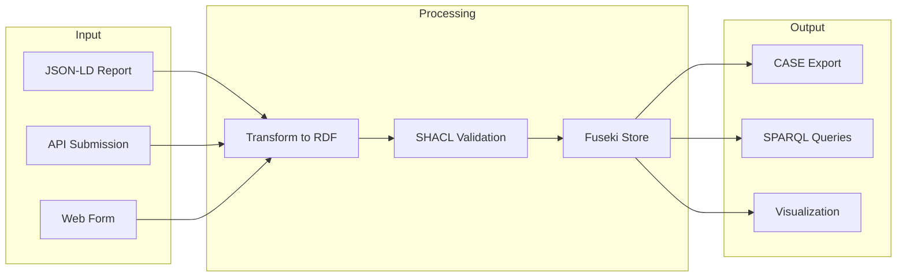
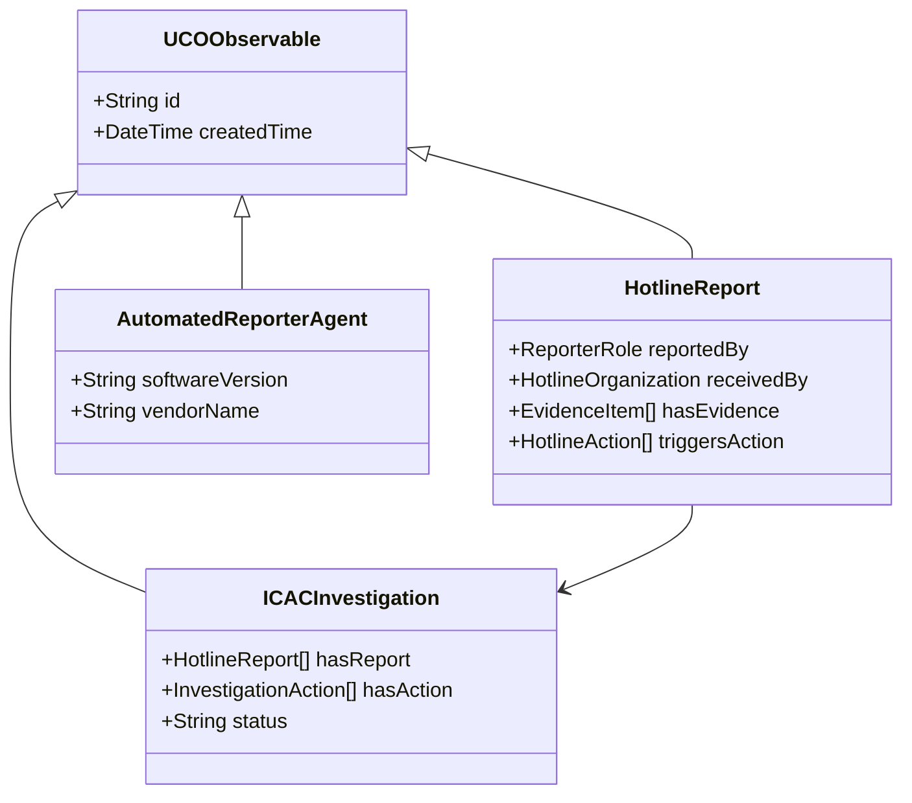
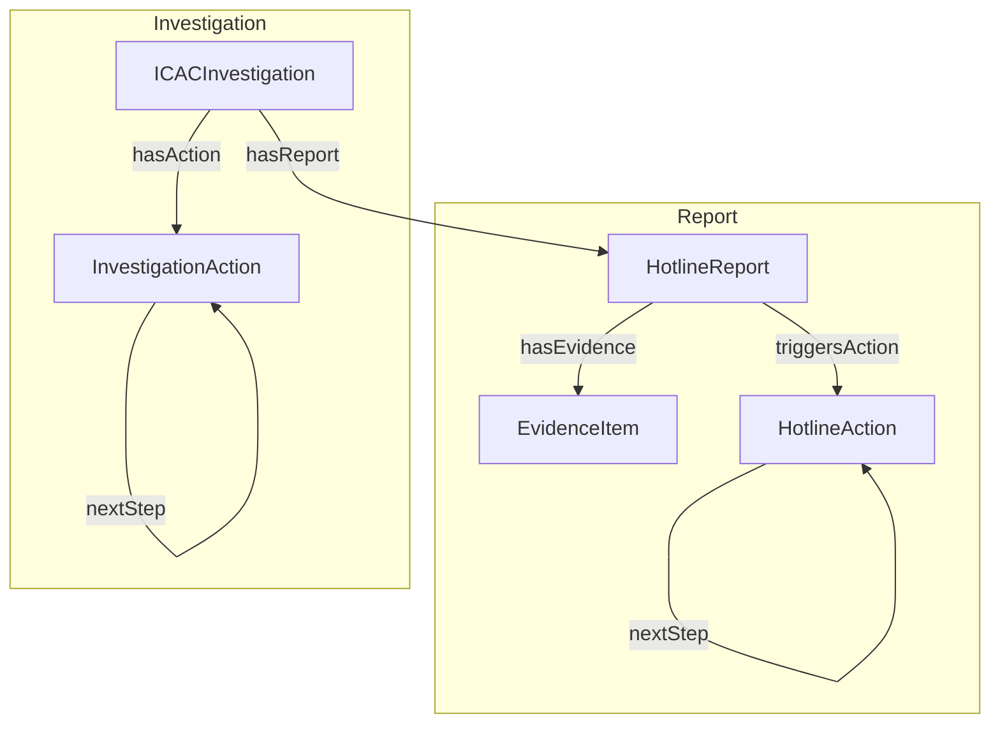

# ICAC Ontology Family Architecture

## Import Chain

```mermaid
graph TD
    subgraph UCO
        UCO[UCO Core]
    end

    subgraph ICAC
        ICAC[icac-core.ttl]
        ICAC_SHAPES[icac-core-shapes.ttl]
        HOTLINES[hotlines-core.ttl]
        HOTLINES_SHAPES[hotlines-core-shapes.ttl]
        NCMEC[icac-us-ncmec.ttl]
    end

    subgraph Examples
        HOTLINE_EX[hotline-lifecycle.ttl]
        INVEST_EX[investigation-lifecycle.ttl]
    end

    UCO --> ICAC
    ICAC --> HOTLINES
    ICAC --> NCMEC
    HOTLINES -.-> HOTLINES_SHAPES
    ICAC -.-> ICAC_SHAPES
    HOTLINES --> HOTLINE_EX
    ICAC --> INVEST_EX

    linkStyle 4,5 stroke-dasharray: 5 5
```

> **Note**: Shapes files (dotted lines) are used for validation but not imported by production graphs.

## Data Flow



## Class Hierarchy



## Property Relationships



## Diagram Export

These diagrams are automatically exported to SVG format in the CI pipeline. You can find the rendered versions in `/docs/img/`:

- `architecture-import-chain.svg`
- `architecture-data-flow.svg`
- `architecture-class-hierarchy.svg`
- `architecture-property-relationships.svg`

See [Glossary](glossary.md) for acronyms and key terms. 