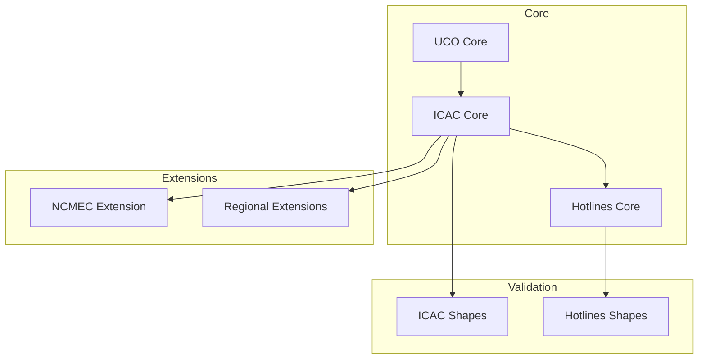

# ICAC Ontology Family - Design Document

## Architecture Overview

### 1. Core Components
The ICAC ontology family consists of several interconnected modules:

#### 1.1 Core Ontologies
- `icac-core.ttl`: Base ontology for ICAC investigations
- `hotlines-core.ttl`: Hotline operations and reporting
- `icac-us-ncmec.ttl`: NCMEC-specific extensions

#### 1.2 Validation Components
- `icac-core-shapes.ttl`: SHACL shapes for core validation
- `hotlines-core-shapes.ttl`: SHACL shapes for hotline validation

#### 1.3 Supporting Components
- JSON-LD contexts for developer integration
- Example data sets
- Testing framework
- Documentation

### 2. Module Relationships



## Design Principles

### 1. Modularity
- Each module has a specific focus
- Clear separation of concerns
- Minimal dependencies between modules
- Easy to extend and maintain

### 2. Interoperability
- Built on UCO foundation
- Compatible with CASE
- Each ontology MUST ship:
  - Turtle (.ttl) format
  - JSON-LD context
  - RDF/XML (optional but recommended)
- Clear mapping to existing standards

### 3. Validation
- Comprehensive SHACL rules
- Clear error messages
- Support for custom validation
- Automated testing
- ≥ 95% of required object & datatype properties MUST be covered by SHACL shapes (tracked in CI)

### 4. Extensibility
- Support for regional variations
- Custom classification schemes
- New evidence types
- Workflow extensions

## Technical Design

### 1. Ontology Structure

#### 1.1 Core Classes

| Class | IRI | SubClassOf |
|-------|-----|------------|
| ICACInvestigation | https://ontology.unifiedcyberontology.org/icac#ICACInvestigation | uco-core:Observable |
| HotlineReport | https://ontology.unifiedcyberontology.org/hotlines/2025/core#HotlineReport | uco-observable:Observation |
| EvidenceItem | https://ontology.unifiedcyberontology.org/hotlines/2025/core#EvidenceItem | uco-observable:DigitalArtifact |
| HotlineAction | https://ontology.unifiedcyberontology.org/hotlines/2025/core#HotlineAction | uco-action:Action |

#### 1.2 Properties
- Object properties for relationships
- Datatype properties for values
- Transitive properties for workflows
- Inverse properties for navigation

#### 1.3 Constraints
- Cardinality restrictions
- Value constraints
- Class restrictions
- Property chains

### 2. Validation Design

#### 2.1 SHACL Shapes
- Node shapes for classes
- Property shapes for properties
- SPARQL rules for complex validation
- Severity levels for violations

#### 2.2 Validation Rules
- Required properties
- Value ranges
- Relationship constraints
- Workflow validation

### 3. Integration Design

#### 3.1 JSON-LD Context
- Compact IRIs
- Type coercion
- Language maps
- Value objects

#### 3.2 API Design
- RESTful endpoints
- SPARQL interface
- Bulk operations
- Error handling

## Implementation Details

### 1. File Organization
```
ontology/icac/
├── icac-core.ttl
├── icac-core-shapes.ttl
├── hotlines-core.ttl
├── hotlines-core-shapes.ttl
├── icac-us-ncmec.ttl
├── contexts/
│   ├── hotlines-core.jsonld
│   └── icac-core.jsonld
├── examples/
│   ├── hotline-lifecycle.ttl
│   └── investigation-lifecycle.ttl
├── queries/
│   └── find_live_stream_incidents.rq
└── docs/
    ├── PRD.md
    ├── design.md
    ├── user_doc.md
    └── img/
        └── architecture.svg
```

### 2. Versioning Strategy
- Semantic versioning
- Backward compatibility
- Deprecation policy
- Migration guides

### 3. Testing Strategy
- Unit tests for ontologies
- Integration tests
- Validation tests
- Performance tests

## Security Design

### 1. Data Protection
- Anonymous reporting
- Data minimization
- Access control
- Audit logging

### 2. Privacy Considerations
- PII handling
- Data retention
- Cross-border sharing
- Consent management

## Performance Design

### 1. Query Optimization
- Indexed properties
- Efficient patterns
- Caching strategy
- Batch operations

### 2. Scalability
- Large dataset support
- Concurrent operations
- Resource management
- Load balancing

## Maintenance Design

### 1. Documentation
- Ontology documentation
- API documentation
- Example documentation
- Change documentation

### 2. Support
- Issue tracking
- Feature requests
- Bug fixes
- Updates

## Future Considerations

### 1. Planned Extensions
- New evidence types
- Additional workflows
- Regional variations
- Integration points

### 2. Technology Evolution
- New standards
- Tool improvements
- Performance optimizations
- Security enhancements
